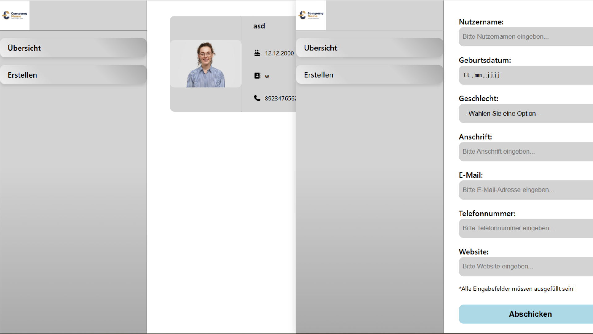

# UserDashboard



Eine responsive CRUD-Webapplikation zur organisierten Erfassung und Verwaltung von Nutzerdaten. Die Anwendung ermöglicht es, neue Profile über eine interaktive Eingabemaske mit clientseitiger Validierung anzulegen, diese in einer dynamischen Liste als User-Cards darzustellen sowie bestehende Einträge zu bearbeiten und zu löschen.

## Voraussetzungen
Für die lokale Ausführung und das Kompilieren des Projekts werden folgende Komponenten benötigt:
* Node.js (aktuelle LTS-Version)
* Ein moderner Webbrowser
* Git (optional, falls Sie das Repository klonen möchten)

## Technologien
* **HTML5:** Semantische Gliederung der Sektionen (`<main>`, `<div id="root">`) und interaktiver Formularelemente zur Gewährleistung der Barrierefreiheit.
* **SCSS:** Modulare Stylesheet-Architektur unter Verwendung globaler Variablen (`!global`), verschachtelter Selektoren, Text-Überlaufschutz-Verfahren (`ellipsis`) und parametrisierter Mixins zur geometrisch einheitlichen Oberflächendefinition.
* **TypeScript:** Strikte, typsichere Datenmodellierung via Interfaces und Union-Typen für eine lückenlose Zustandskontrolle.
* **React:** Komponentenbasiertes UI-Rendering, Single-Page-Routing via React Router, globale Kontextverteilung und fortgeschrittene Zustandsverwaltung über einen Reducer.
* **FontAwesome:** Integration skalierbarer Vektor-Icons zur visuellen Unterstützung einzelner Datenattribute innerhalb der Benutzeroberfläche.
* **Vite:** Performantes Frontend-Build-Tool für eine schnelle Entwicklungsumgebung und optimierte Produktions-Builds.

## Technische Funktionsweise
Die Anwendung basiert auf einer komponentenorientierten Client-Side-Architektur und implementiert folgende Kernkomponenten:

### Datenmodellierung und Typsicherheit (`user.type.ts` & `useUserReducer.ts`)
Das Projekt nutzt TypeScript zur Gewährleistung der vollständigen Datenintegrität über alle Komponentenebenen hinweg:
* **Strikte Typdeklaration:** Ein dedizierter `User`-Typ definiert alle Profildaten, wobei Telefonnummern (`phoneNumber`) und IDs (`id`) als numerische Datentypen deklariert werden.
* **Diskriminiertes Union-Pattern:** Der Typ `UserAction` schränkt die erlaubten Zustandsänderungen im Reducer auf die Aktionen `ADD_USER`, `REMOVE_USER` und `UPDATE_USER` inklusive der jeweils geforderten Payload-Strukturen ein. Die Funktion `useUserReducer` verarbeitet diese Modifikationen zustandstreu und unveränderlich mittels `.filter()` und `.map()`.

### Zentrales State-Management und Routing (`App.tsx` & `userContext.ts`)
* **Zentraler Kontext (React Context):** Das Interface `UserContextType` erzwingt eine strikte Koppelung an das Datenmodell. Der globale Benutzerzustand (`users`) und die zugehörige `dispatch`-Funktion werden über einen `<UserContext.Provider>` global zur Verfügung gestellt, um unübersichtliches Prop-Drilling zu vermeiden. Ein integrierter Guard-Check im Custom Hook `useUserContext()` blockiert Laufzeitfehler bei unautorisierten Aufrufen außerhalb des Providers.
* **Lazy State & Persistenz:** Beim App-Start werden bestehende JSON-Daten über eine anonyme Initialisierungsfunktion geladen. Ein `useEffect`-Hook synchronisiert das Benutzer-Array bei jeder Zustandsänderung in Echtzeit mit dem `localStorage`.
* **Verschachteltes Routing:** Der `createBrowserRouter` steuert das Client-Side-Routing über ein übergeordnetes Shell-Layout (`Root`) mit einer Fehlerabfangseite (`ErrorPage`). Die Ansichten (`Overview`, `Create`, `Edit/:id`) werden dynamisch in die Platzhalter-Komponente `<Outlet />` injiziert. Der gesetzte `basename: "/User-Uebersicht"` bereitet die App optimal für GitHub Pages vor.

### Eingabeabstraktion und defensive Validierung (`Edit.tsx`, `Create.tsx` & `useInputValue.ts`)
* **Generischer Input-Hook:** Der Custom Hook `useInputValue` verwaltet die Zustandshaltung von Formularfeld-Komponenten. Über einen flexiblen Event-Handler, der auf `ChangeEvent<HTMLInputElement | HTMLSelectElement>` horcht, werden Textfelder, Kalender und Dropdowns einheitlich bedient.
* **Zweistufige Formularvalidierung:** Vor dem Auslösen von Reducer-Aktionen durchlaufen die Formulardaten eine clientseitige Überprüfung. Durch `.some()` wird geprüft, ob Felder leer sind oder nur aus Leerzeichen bestehen. Die `Create`-Komponente prüft zusätzlich über `isNaN(Number(...))`, ob das Telefonnummernfeld ausschließlich Ziffern enthält.
* **ID-Generierung & Navigation:** Beim Neuanlegen wird die Eindeutigkeit der Profile über den Zeitstempel-Mechanismus `Date.now()` gesichert. Nach erfolgreicher Verarbeitung leitet der `useNavigate`-Hook den Benutzer autonom zurück zur Hauptübersicht.

### Interaktive Daten-Präsentation und Barrierefreiheit (`UserCard.tsx` & Formular-Inputs)
Die Komponente `UserCard` stellt Datensätze visuell als strukturierte Visitenkarten dar:
* **Event-Bubbling-Schutz:** Da die gesamte Karte interaktiv ist und bei Klick auf die ID-basierte Editierungsroute verzweigt, ist die Löschschaltfläche mit einem logischen Guard versehen. Durch `e.stopPropagation()` wird das Hochsprudeln des Klick-Events unterbunden, um eine fehlerhafte Weiterleitung zu blockieren.
* **Lokalisierte Datumskonvertierung:** Das im ISO-Format abgespeicherte Geburtsdatum wird zur Laufzeit über ein natives `Date`-Objekt geparst und mittels `.toLocaleDateString("de-DE")` in das deutsche Format (TT.MM.JJJJ) umgewandelt.
* **Semantische Input-Kapselung:** Die Komponenten `FreeInput`, `DateInput` und `SelectInput` implementieren eine enge Verknüpfung von Label und Steuerelement (entweder durch strukturelle Verschachtelung oder explizite `htmlFor`- und `id`-Zuweisung). Dies garantiert eine barrierefreie Zuordnung für Screenreader. Im Bearbeitungsmodus sorgt die `inputValue`-Prüfung im Selektor zudem für eine automatische Vorauswahl des gespeicherten Geschlechtsstatus.

## Layout und Design
Das visuelle Erscheinungsbild wird durch ein flächenfüllendes CSS-Layout und wiederverwendbare SCSS-Bausteine bestimmt:
* **Flexible Geometrie (`Root.scss` & `UserCard.scss`):** Das Hauptlayout nutzt eine horizontale Flexbox (`100vw`/`100vh`) mit gesetztem `overflow: hidden`, um Scrollbalken auf Anwendungsebene zu unterdrücken. Die `.sidebar` nimmt eine fixe Breite von `20vw` ein, während der `.content-container` mittels `flex-grow: 1` den verbleibenden Platz ausfüllt. Benutzerkarten besitzen feste Dimensionen (`400px` x `200px`) und nutzen eine relationale Hover-Verschachtelung (`&:hover`), um Hintergrundfarben flüssig und kantenfrei an Untercontainer weiterzuvererben.
* **Auto-Fill Grid-System (`Overview.scss`):** Die Übersichtsseite ordnet die User-Cards über ein hochflexibles CSS-Grid an. Die Anweisung `grid-template-columns: repeat(auto-fill, 400px)` bricht die Karten automatisch je nach verfügbarer Bildschirmbreite in die nächste Zeile um. Zu lange Zeichenketten (z. B. E-Mails oder URLs) werden im Grid über einen kombinierten Textschutz (`text-overflow: ellipsis`) sauber abgekürzt.

## Installation
Klonen Sie das Projekt auf Ihren lokalen Computer und installieren Sie die erforderlichen Abhängigkeiten über den Paketmanager:

```bash
# Repository klonen
git clone https://github.com

# In den Projektordner navigieren
cd user-uebersicht

# Abhängigkeiten installieren
npm install
```

## Nutzung
1. Starten Sie den lokalen Vite-Entwicklungsserver mit folgendem Befehl:
   ```bash
   npm run dev
   ```
2. Öffnen Sie die in der Konsole angezeigte lokale URL (Standard: `http://localhost:5173`) in Ihrem Webbrowser.
3. Nutzen Sie die Seitenleiste, um zwischen der Übersicht aller registrierten Profile und der Eingabemaske zum Erstellen neuer Nutzer zu wechseln.
4. Füllen Sie beim Neuanlegen oder Bearbeiten alle Pflichtfelder aus; das System validiert die Eingaben (Ziffernprüfung bei Telefonnummern) in Echtzeit.
5. Verwalten Sie Datensätze direkt über die generierten User-Cards, um Profile über die ID-Routen anzupassen oder vollständig aus dem Speicher zu entfernen.

## Deployment
Die Website kann direkt über GitHub Pages gehostet werden:
1. Gehen Sie auf GitHub in die Settings Ihres Repositories.
2. Klicken Sie im linken Menü auf Pages.
3. Wählen Sie unter Build and deployment den `main` (oder `master`) Branch aus und klicken Sie auf Save.
4. Nach wenigen Minuten ist die Website live unter Ihrer GitHub-Pages-URL erreichbar.

## Lizenz
Dieses Projekt wurde von Xenia Wilczek erstellt. Alle Rechte an Code und Design vorbehalten (All Rights Reserved).
